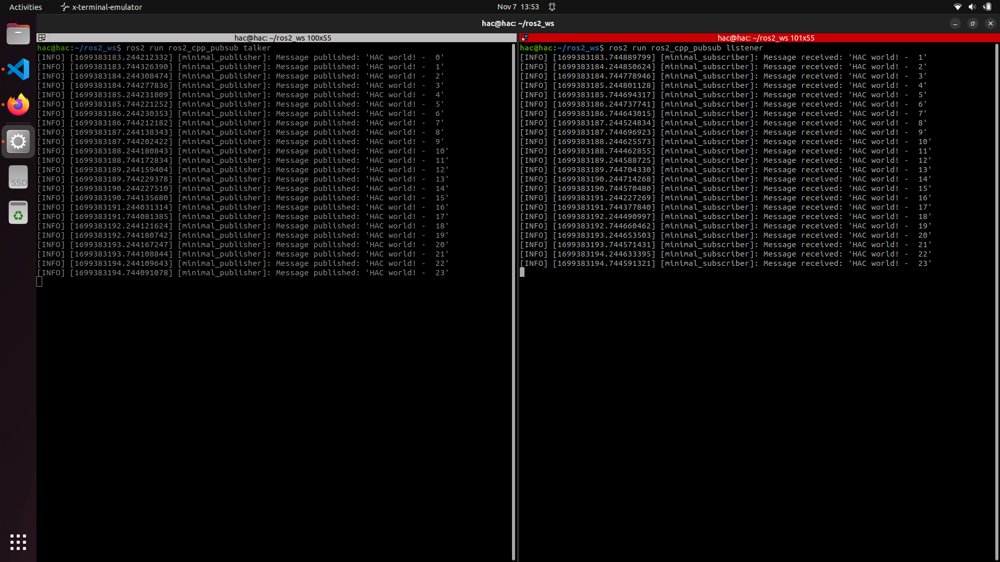

# beginner_tutorials

## Overview

Beginner tutorial for creating a simple `publisher` and `subscriber` in C++ for ROS2 (Humble).

## Building and Running

Clone the repository in your ROS2 workspace.

```sh
cd < path_to_your_workspace >/src

# For cloning using SSH
git clone git@github.com:Hritvik-Choudhari0411/beginner_tutorials.git

# For cloning using HTTPS
git clone https://github.com/Hritvik-Choudhari0411/beginner_tutorials.git
```

### Build

To build the package follow the following steps

```sh
# Source to ROS2 HUMBLE
source /opt/ros/humble/setup.bash

cd .. # Make sure you are in the source directory of ROS 2 and not in src

# Install rosdep dependencies before building the package
rosdep install -i --from-path src --rosdistro humble -y

# Build the package using colcon build
colcon build --packages-select ros2_cpp_pubsub

# Source your setup file
. install/setup.bash
```

### Run

To run the `publisher` and `subscriber`.

```sh
# Run the publisher in Terminal 1
ros2 run beginner_tutorials talker
```

```sh
cd < path_to_your_workspace >

# Source your setup file
. install/setup.bash
 
# Run the publisher in Terminal 2
ros2 run beginner_tutorial listener
```
## Cpplint and CppCheck
```sh
# Run the below command for cppcheck inside the root directory of your workspace
cppcheck --enable=all --std=c++17 --suppress=missingIncludeSystem $( find . -name *.cpp | grep -vE -e "^./build/" ) --check-config > results/cppcheck.txt

# Run the below command for cpplint by moving into root directory of your workspace 
cpplint --filter=-build/c++11,+build/c++17,-build/namespaces,-build/include_order  src/cpp_pubsub/src/*.cpp >  results/cpplint.txt
```

## Dependencies

- [ROS2 Humble](https://docs.ros.org/en/humble/index.html)
- CMake Version 3.8 or greater
- C++ 17 or newer

## Results

Left : Talker (Publisher)

Right: Listener (Subscriber)



## Assumptions

The above instruction assume that you have installed all the Dependecies and are working on a Ubuntu 22.04 LTS system and have created your ROS2 workspace beforehand.
