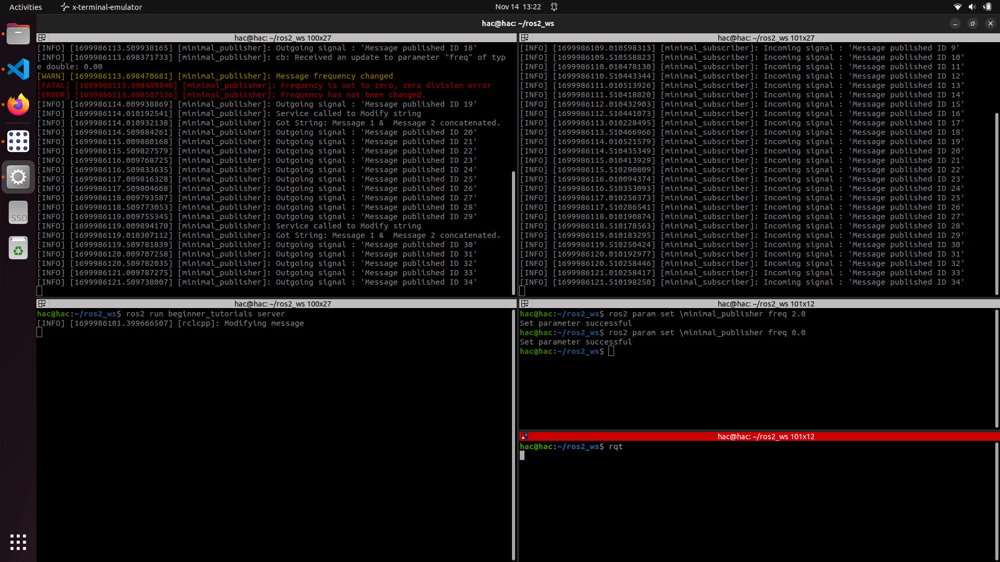
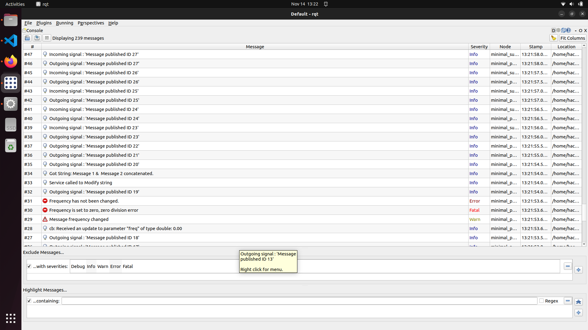
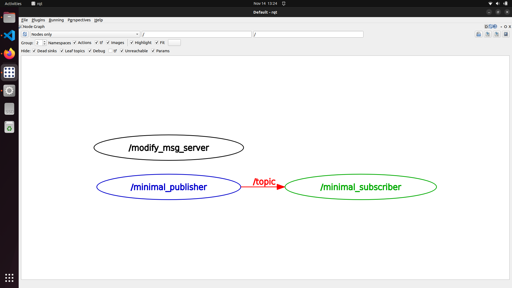

# beginner_tutorials

## Overview

Beginner tutorial for creating a simple `publisher` and `subscriber` with `service` in C++ for ROS2 (Humble).

## Task

- Modify the publisher node to publish a custom string message

- Create a launch file that launches both nodes and accepts at least one command-line argument that modifies one or both nodes in some way.

- Modify the tutorial code to follow Google C++ Style Guide (with course modifications)

- Run cpplint on your ROS package files and save the output as a text file to the results folder

- Run cppcheck on your ROS package files and save the output as a text file to the results folder

## Dependencies

- rclcpp

- stdmsgs

- OS: Ubuntu Linux 22.04

- ROS Version: ROS2 Humble Hawksbill

## Building and Running

Clone the repository in your ROS2 workspace.

```sh
cd < path_to_your_workspace >/src

# For cloning using SSH
git clone git@github.com:Hritvik-Choudhari0411/beginner_tutorials.git

# For cloning using HTTPS
git clone https://github.com/Hritvik-Choudhari0411/beginner_tutorials.git
```

### Build

To build the package follow the following steps

```sh
cd .. # Make sure you are in the source directory of ROS 2 and not in src

# Source to ROS2 HUMBLE
source /opt/ros/humble/setup.bash

# Install rosdep dependencies before building the package
rosdep install -i --from-path src --rosdistro humble -y

# Build the package using 
colcon build --packages-select beginner_tutorials

# Source your setup file
cd ~/ros2_ws

. install/setup.bash
```

### Using the launch file

To run the launch file and initate the publisher, subscriber and the service

```sh
cd ~/ros2_ws/src/beginner_tutorials/launch

ros2 launch ros_services_logging.yaml frequency:=2.0
```

### Launch the nodes

To launch the `publisher` node in terminal 1,

```sh
cd ~/ros2_ws

. install/setup.bash
```

```sh
# Run the publisher in Terminal 1

ros2 run beginner_tutorials talker
```

To launch the `subscriber` node in terminal 2

```sh
cd ~/ros2_ws

. install/setup.bash
```

```sh
# Run the subscriber in Terminal 2

ros2 run beginner_tutorials listener
```

To launch the `server` node in terminal 3

```sh
cd ~/ros2_ws

. install/setup.bash
 ```
```sh
# Run the server in Terminal 3

ros2 run beginner_tutorial server
```

### Change the ```frequency``` parameter

```sh
ros2 param set \minimal_publisher freq 10.0
```

## Cppcheck and Cpplint

To run the CppCheck

```sh
sh cppcheck.sh
```

To run the Cpplint

```sh
sh cpplint.sh
```

## Results

Publisher, Subscriber and Service nodes



rqt_console



rqt_graph



## References

[1] http://docs.ros.org/en/humble/index.html

## Assumptions

The above instruction assume that you have installed all the Dependecies and are working on a Ubuntu 22.04 LTS system and have created your ROS2 workspace beforehand.
